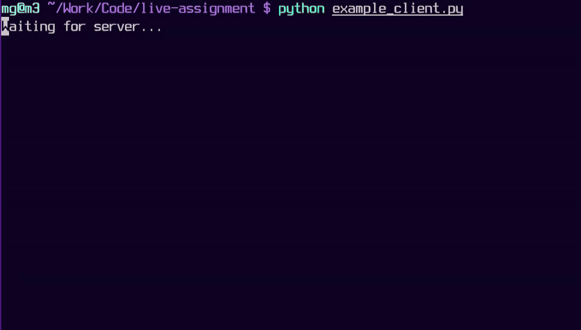

# Live Transcript Assignment



## Scenario

A FastAPI server simulates a live earnings call transcript. It serves a growing [JSON Lines](https://jsonlines.org/) stream — one JSON object per line — just as it would from S3 during a real event.

The stream contains **word-level entries** that build up the text, and **refinement instructions** that correct previously delivered words and paragraphs.

## Task

Build a Python **TUI** that:

1. Polls the server to incrementally consume new lines as they appear
2. Groups words into paragraphs with speaker labels
3. Applies refinement instructions to update already-displayed text
4. Shows the transcript updating live in the terminal

Use any libraries you like. `httpx`, `rich`, and `textual` are included as suggestions.

## Bonus

- Use HTTP byte-range requests (`Range: bytes=N-`) for efficient incremental polling
- Handle `[indiscernible]` markers
- Visual indication when refinements update existing text
- Paragraph-level speaker via majority vote (see below)
- Tests for the refinement logic

## Getting started

```bash
pip install -e .
uvicorn server:app
curl http://localhost:8000/transcript
```

| Endpoint | Description |
|---|---|
| `GET /transcript?speed=1` | Lines available up to current simulated time. `speed` (default 1) is a playback multiplier. |
| `GET /transcript/status?speed=1` | `not_started`, `live`, or `ended`. |
| `POST /reset` | Resets the simulation clock. |

The server supports `Range: bytes=N-` headers (returns 206). The clock starts on first request to `/transcript`.

---

## Format specification

Each line is a JSON object. The `type` field indicates the record type. If `type` is missing, the record is an **entry**.

### Entries

A single word in the transcript. The most common record type.

| Field | Type | Description |
|---|---|---|
| `t` | string | The word. `[indiscernible]` means low confidence. |
| `s` | number | Start time (seconds). |
| `e` | number | End time (seconds). |
| `p` | string | Paragraph id — words with the same `p` belong together. |
| `S` | string | Speaker index (uppercase, 0-indexed). May be missing. |
| `ot` | string | Original text when `t` is `[indiscernible]`. |
| `c` | number | Confidence score. |

```json
{"s": 585.32, "e": 585.6, "p": "10", "t": "you.", "S": "20"}
```

Ignore unknown keys — the format may be extended.

### Control records

- **`start`** — first record, metadata only.
- **`keep-alive`** — stream is active, no content. Ignore.
- **`end`** — final record. Stop polling. Has optional `code` (0 = success) and `user_reason`.
- **`interruption`** — transcription error. Has `time` (seconds) and `restarting` (bool).
- **`section`** — marks start/end of a section (e.g. `predicted-qna`, `predicted-speech`). Has `name` and either `s` or `e`.
- **Unknown types** — ignore them.

### Refinement instructions

Records with an `i` field correct previously delivered content. Apply in order.

| Instruction | Fields | Effect |
|---|---|---|
| `word-update` | `s`, `rt` | Replace the word at timestamp `s` with `rt`. |
| `word-delete` | `s` | Remove the word at timestamp `s`. |
| `word-insert` | `s`, `e`, `rt` | Insert a new word at timestamp `s`. |
| `paragraph-insert` | `s` | Split paragraph: words with `s` < timestamp stay, words with `s` >= timestamp move to a new paragraph. |
| `paragraph-merge` | `s`, `e` | Merge paragraphs in time range (currently unused). |

Instructions arrive in chunks. For example, splitting "TomHanks" into two words is a `word-delete` + two `word-insert`s.

### Example

```json
{"s":1493.2,"e":1493.44,"p":"17","t":"close","S":"2"}
{"s":1493.44,"e":1493.72,"p":"17","t":"with","S":"2"}
{"s":1495.2,"e":1495.44,"p":"17","t":"good","S":"2"}
{"s":1495.44,"e":1495.96,"p":"17","t":"news","S":"2"}
{"s":1496.4,"e":1496.4,"p":"17","t":"?","S":"2"}
{"s":1495.44,"e":null,"rt":null,"i":"word-delete"}
{"s":1496.4,"e":null,"rt":null,"i":"word-delete"}
{"s":1495.44,"e":1496.4,"rt":"news?","i":"word-insert"}
```

The refinements delete "news" and "?" then insert "news?" — merging them into one token.

### Paragraph-level speakers

Speaker indexes (`S`) can fluctuate within a paragraph. Use **majority vote** for a stable label: the most common `S` in a paragraph is its speaker. UIs may display 1-indexed (Speaker 1, Speaker 2, ...).

---

## My solution

### What I built

Two TUI implementations that both consume the same polling + refinement logic:

- **`tui_basic.py`** — dependency-free terminal viewer using ANSI escape codes. Full-screen redraw on each poll cycle, subtitle-style: paragraphs build up in place, speaker label only shown when the speaker changes.
- **`tui.py`** — [Textual](https://textual.textualize.io/) TUI. One `Static` widget per paragraph, updated in-place as words and refinements arrive. Byte counter shown in a status bar at the bottom.

Core logic lives in `transcript/`:

- `entries.py` — `Word` and `Paragraph` dataclasses. `Paragraph.speaker()` uses majority vote via `Counter`.
- `refinements.py` — apply functions for every refinement instruction type (`word-update`, `word-delete`, `word-insert`, `paragraph-insert`).
- `handler.py` — parses each JSONL line and dispatches to the right apply function.
- `state.py` — shared `StreamState` (paragraphs list + byte offset + status).

`poller.py` polls `GET /transcript` using `Range: bytes=N-` headers so only new bytes are fetched each cycle. Both TUIs call `poll()` in an async task alongside their display loop.

Paragraphs are sorted chronologically by their earliest word timestamp before display — necessary because `paragraph-insert` can leave the list in non-chronological order.

### Setup and run

```bash
# 1. Create and activate a virtual environment
python3 -m venv .venv
source .venv/bin/activate          # Windows: .venv\Scripts\activate

# 2. Install all dependencies (FastAPI, uvicorn, httpx, textual, rich)
pip install -e .

# 3. In one terminal — start the server
uvicorn server:app

# 4. In another terminal (same venv) — run one of the TUIs
python tui_basic.py       # simple, no extra dependencies
python tui.py             # Textual TUI

# Press q (tui.py) or Ctrl-C (tui_basic.py) to exit
```

### Tests

```bash
python test_handler.py    # 23 unit tests for all refinement operations
```
